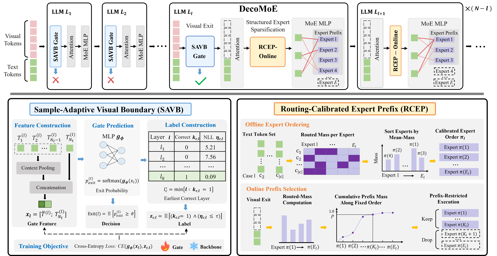

# DecoMoE

**DecoMoE: Decoupling Visual Propagation and Expert Computation for Efficient Multimodal MoE Inference**

DecoMoE is an efficient inference framework for multimodal Mixture-of-Experts (MoE) models. It targets two major sources of redundant computation in multimodal MoE inference: prolonged visual-token propagation and excessive expert computation.

DecoMoE decouples these two dimensions through:

- **Sample-Adaptive Visual Boundary (SAVB):** predicts an input-dependent boundary for visual-token propagation and removes the complete visual-token block once sufficient visual information has been transferred to the text states.
- **Routing-Calibrated Expert Prefix (RCEP):** derives a text-aligned expert order from offline routing statistics and dynamically retains a compact contiguous expert prefix during subsequent inference.

Together, DecoMoE performs structured compression along both the **token** and **expert** dimensions, reducing multimodal MoE inference cost while preserving model performance.

---

## Motivation

  

Multimodal MoE inference involves substantial computation along two complementary dimensions. Long visual-token sequences repeatedly increase the cost of **self-attention**, while MoE layers introduce additional **expert routing and expert-MLP computation**.

Existing efficient inference methods typically compress only one of these dimensions. Visual-token pruning reduces the token sequence but largely preserves the original expert computation, while expert compression reduces the expert dimension without explicitly controlling how long visual tokens should propagate through the decoder.

DecoMoE instead performs **structured compression in both dimensions**. SAVB removes the complete visual-token block at a sample-dependent boundary, while RCEP organizes important experts into a physically contiguous prefix and dynamically adjusts the retained prefix during inference.

The left panel additionally profiles the per-layer inference cost and shows that attention and expert-MLP computation jointly dominate the measured latency, motivating the joint optimization of both components.

> Click the figure to view the high-resolution PDF.

---

## Method

  

DecoMoE consists of two complementary components that operate at different stages of multimodal MoE inference.

### Sample-Adaptive Visual Boundary (SAVB)

SAVB determines **when visual tokens can stop propagating** through the decoder. At sparse candidate layers, a lightweight gate constructs a feature from the current text hidden states and predicts whether the visual-token block can be removed.

The gate is supervised using forced visual-exit results based on answer correctness and first-token negative log-likelihood (NLL), while the multimodal backbone remains frozen. This enables the visual propagation depth to adapt to individual image-prompt pairs rather than relying on a globally fixed exit layer.

### Routing-Calibrated Expert Prefix (RCEP)

After visual exit, inference becomes text-dominated. RCEP exploits the observation that text-token routing exhibits more concentrated and recurrent expert-importance patterns across samples.

During offline calibration, RCEP computes text-token routed mass and constructs a layer-wise expert order according to the mean routed mass across calibration cases. The corresponding router and expert parameters are reordered consistently so that important experts occupy a **contiguous physical prefix**.

During online inference, RCEP dynamically selects the shortest expert prefix that covers a target fraction of the current routed mass and performs native Top-k routing within the retained prefix. The prefix length can therefore adapt across inputs and decoder layers while maintaining structured expert execution.

Together, SAVB and RCEP decouple **sample-dependent visual propagation** from **text-aligned expert computation**, enabling structured token and expert reduction within a unified inference framework.

> Click the figure to view the high-resolution PDF.

---

## Code

The implementation and evaluation code for DecoMoE will be released soon.

**Code coming soon.**

---

## Citation

Citation information will be updated after the paper is publicly available.
